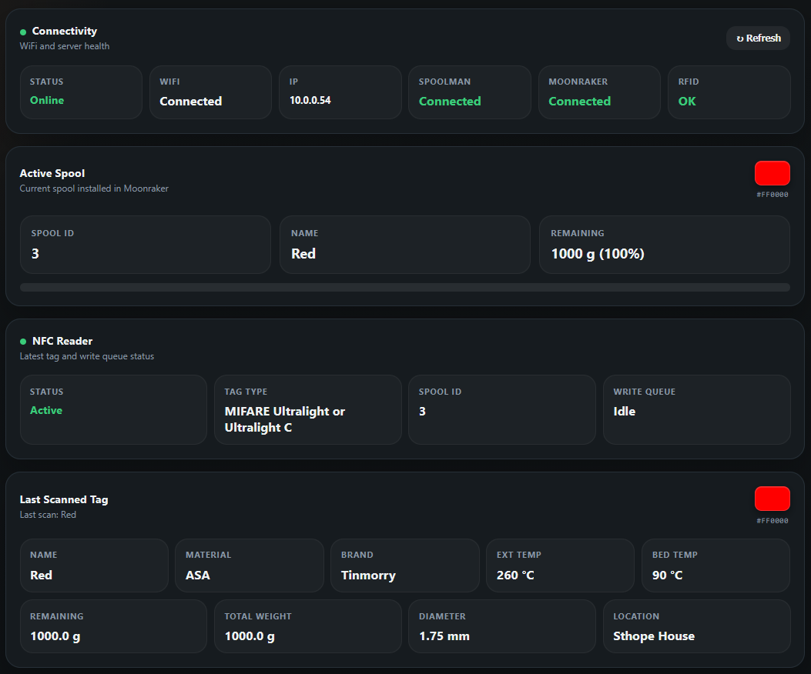

# ESPoolman

An ESP32-C6 firmware that reads NFC filament spool tags and displays spool data from a [Spoolman](https://github.com/Donkie/Spoolman) server via a self-hosted web interface. Optionally integrates with [Moonraker](https://github.com/Arksine/moonraker) to track the currently loaded spool.

## Features

- Reads NFC tags (MIFARE Classic / NTAG) from filament spools
- Fetches spool data from a Spoolman instance
- Moonraker integration to show the active spool on your printer
- Write spool data to NFC tags from the WebUI
- Spool inventory browser with grid, list, and table views

## Hardware

- ESP32-C6 Super Mini
- RC522 NFC reader module

## Getting Started

1. Clone this repo and open the folder in [PlatformIO](https://platformio.org/)
2. (Optional) Add your WiFi and server details to `platformio.ini` under `[credentials]` for a zero-config first boot
3. Build and flash
4. Connect to the device's WiFi AP (if credentials were not loaded) and configure via the WebUI

## Acknowledgements

This project was inspired by:

- [nfc2klipper](https://github.com/bofh69/nfc2klipper) by **bofh69** — NFC tag reading for Klipper/filament management
- [esp_to_spoolman](https://github.com/dimbas80/esp_to_spoolman) by **dimbas80** — ESP-based Spoolman integration
- [SpoolCompanion](https://github.com/V-aruu/SpoolCompanion) by **V-aruu** — Android app to write Spoolman spool data to NFC tags directly from your phone

## License

[CC BY-NC-SA 4.0](LICENSE) — Free for personal and non-commercial use. Modifications must be shared under the same license. Commercial use is not permitted.
